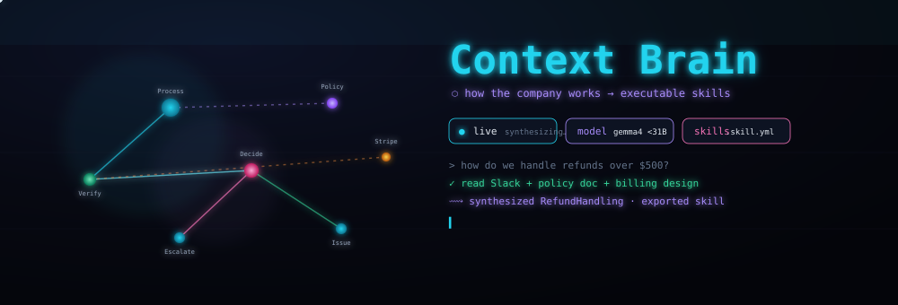
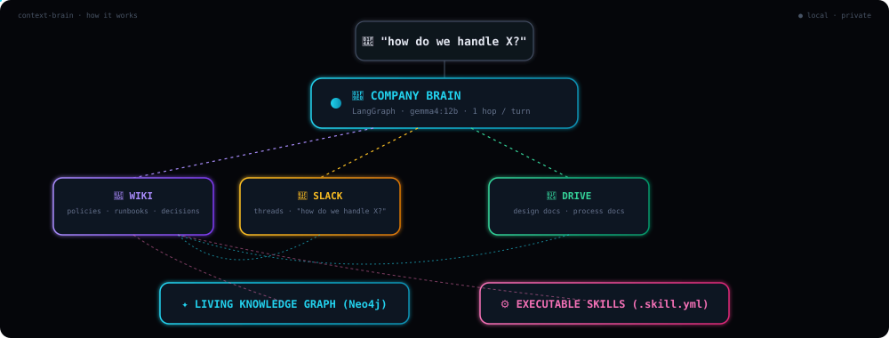
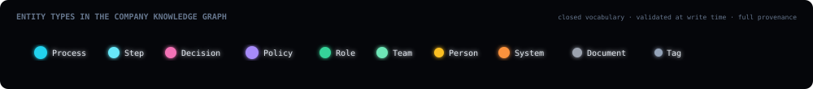

<div align="center">



[](#-the-stack)
[](#-the-stack)
[](#-the-stack)
[](#-the-stack)
[](#-the-stack)
[](LICENSE)
[](#-deployment-status)

**An AI that understands how a company works end-to-end and turns it into executable skills.**
Runs entirely on your own hardware. 100% open source · zero cloud · zero paid keys.

</div>

---

## The idea

> Every company has critical know-how scattered everywhere — in people's heads,
> buried in Slack threads, support tickets, wikis, and docs. The company works
> because humans vaguely remember where that knowledge is. But AI agents can't
> operate like that.
>
> What we need is a **context brain**: a system that pulls knowledge out of all
> these fragmented sources, structures it, keeps it current, and turns it into
> an **executable skills file** for AI. A living map of how a company works:
> how refunds get handled, how pricing exceptions are decided, how engineers
> respond to incidents.

**Context Brain** is an open-source implementation of that idea. It's *not* a
search box or a chatbot over documents. It reads a company's own knowledge
sources (Slack, Drive, wiki), builds a **living knowledge graph** of the
processes, decisions, and policies it discovers, and synthesizes them into
**executable skill files** other AI systems can load and run.

---

## See it work



Ask *"how do we handle refunds over $500?"* — the Brain reads the Slack
threads, the refund policy, and the billing design doc, then **synthesizes a
process graph** (verify → decide → escalate/issue → log) and **exports an
executable `refund-handling.skill.yml`**.

---

## How it works



A single **orchestrator agent** (LangGraph + `gemma4:12b`) routes each turn to
the right **context provider** — one of the company knowledge sources (Slack,
Drive, wiki). It reads what it needs, then **synthesizes** a Process (with
Steps, Decisions, Policies, owners, and systems) into the Neo4j graph and
exports the executable skill file. The graph *is* the memory — it grows with
every question, so company knowledge accumulates.

---

## ✨ Highlights

| | |
|:---|:---|
| 🧠 **Understands, doesn't just search** | Synthesizes "how we handle X" into a structured process — Steps, Decisions, governing Policies — not a list of document links. |
| ⚙️ **Executable skills** | Every process is exported as a `.skill.yml` file (trigger, owner, steps/decisions, constraints, systems) that an AI agent can load and run. The missing layer between raw data and automation. |
| 🔒 **Private by design** | Runs on `gemma4:12b` (<31B params) via Ollama on your own hardware. Company knowledge never leaves your network — no cloud calls, no API bills. |
| 🕸️ **The graph *is* the memory** | Processes, steps, policies, roles, systems — all connected in Neo4j. Knowledge accumulates across sessions and is queryable. |
| 🔬 **Full provenance** | Every node traces back to the exact Slack thread / doc / policy it was derived from. You can audit *why* the Brain thinks refunds >$500 escalate. |
| 🔒 **Single-write-surface safety** | Only the Brain provider can write the graph, through a schema-validated skills engine. A typo can't corrupt the knowledge model. |
| 🎨 **Immersive visualization** | Fly through the process graph in 3D, toggle to 2D for analysis, inspect any step's provenance. |

---

## 🧱 The stack

| Layer | Choice | Why |
|---|---|---|
| **Agent orchestration** | LangGraph + FastAPI | Open, stateful, streams tokens over SSE |
| **Reasoning model** | `gemma4:12b` via Ollama | Local (<31B), built for agentic workflows, Apache 2.0 |
| **Embeddings** | `bge-m3` via Ollama | Semantic search over process knowledge |
| **Knowledge graph** | Neo4j Community 5.x | The living map — processes, steps, policies, relationships |
| **Skills engine** | pydantic-validated plans → `.skill.yml` (PyYAML) | The executable-skills differentiator |
| **Company sources** | wiki (markdown) · Slack (JSONL/API) · Drive (docs/API) | Where company know-how actually lives |
| **Frontend** | Next.js 14 · react-force-graph-3d · Cytoscape.js | 3D process exploration + 2D analysis + skills viewer |
| **Infra** | Docker Compose (4 services) | One command boots the whole platform |

<details>
<summary><b>🏗️ Architecture principles</b></summary>

- **One reasoning step per turn.** The orchestrator reads the question, calls the minimal sources, synthesizes, answers. No unbounded loops.
- **Provider isolation.** Each source (Slack/Drive/wiki) is a sub-agent owning its quirks. The orchestrator sees only clean `query_<source>` / `update_brain` tools.
- **Read/write separation.** Sources are read-only. Only the Brain provider writes the graph, through a validated plan.
- **Closed, provenanced schema.** A fixed vocabulary (Process, Step, Decision, Policy, Role, Team, Person, System, Document) enforced at write time, every node carrying provenance.
- **Graceful degradation.** Sources self-report health and fail cleanly.
</details>

---

## 📊 Deployment status

> **Self-hosted / local.** Runs on `localhost` on your own machine — not
> exposed to the internet. That's intentional: company knowledge is sensitive.

The Brain ships with a **seeded sample company "Northwind"** (wiki pages, Slack
threads, Drive docs) so it runs instantly with **zero credentials**. Point it
at real Slack/Drive later by setting env vars.

```bash
git clone https://github.com/swayamiitb/SAAS_-AI.git
cd SAAS_-AI

cp .env.example .env
docker compose up -d          # Neo4j · Ollama · API · Web
./scripts/ollama_pull.sh      # gemma4:12b + bge-m3 (a few GB)

open http://localhost:3000    # the Brain console
```

Then ask: *"how do we handle refunds over $500?"*

**Verified:** ruff, mypy, 51 unit tests, 8 architecture invariants all pass;
providers tested against the live seeded company data.

| Service | URL | Purpose |
|---|---|---|
| 🧠 **Brain console** | http://localhost:3000 | 3D/2D graph + chat + skills |
| ⚙️ **API** | http://localhost:8000/docs | FastAPI Swagger docs |
| 🕸️ **Neo4j Browser** | http://localhost:7474 | Browse the raw graph |
| 🧠 **Ollama** | http://localhost:11434 | Local model runtime |

<details>
<summary><b>🔧 Running the backend without Docker</b></summary>

```bash
python -m venv .venv && source .venv/bin/activate   # Windows: .venv\Scripts\activate
pip install -e ".[dev]"

cd backend
PYTHONPATH=. uvicorn app.main:app --reload      # API on :8000
PYTHONPATH=. python -m context_brain chat       # …or the CLI
```

Frontend needs Node 20: `cd frontend && npm install && npm run dev`.
</details>

---

## 🕸️ The knowledge graph

A **closed vocabulary** models how a company works.



**Nodes** — `Process` · `Step` · `Decision` · `Policy` · `Role` · `Team` · `Person` · `System` · `Document` · `Tag`

**Edges** — `HAS_STEP` · `NEXT` · `IF` (decision branches) · `GOVERNED_BY` · `OWNED_BY` · `EXECUTED_BY` · `USES` · `EXTRACTED_FROM` (provenance)

Every node carries `source`, `confidence`, `first_seen`, `last_seen`. Schema in [`docs/ARCHITECTURE.md`](docs/ARCHITECTURE.md).

---

## ⚙️ Executable skills

The differentiator. A synthesized process becomes a machine-readable file an AI agent loads and runs:

```yaml
# skills/refund-handling.skill.yml
name: Refund Handling
process: RefundHandling
trigger: customer requests a refund
owner: role:support-agent
steps:
  - id: verify
    name: Verify charge
    uses: [Stripe]
  - id: decide
    if: amount > 500
    then: escalate
    else: issue
  - id: issue
    name: Issue refund
    uses: [Stripe, Zendesk]
constraints:
  - never refund more than 2x original
provenance:
  - document: RefundPolicy
  - document: BillingSystemsDesign
```

---

## 🛠️ CLI

```bash
python -m context_brain chat          # ask how the company works
python -m context_brain providers     # show source status
python -m context_brain graph-stats   # node / edge counts
python -m context_brain skills        # list exported skill files
python -m context_brain clear-graph   # wipe the graph (prompts)
```

---

## ✅ Quality & evaluation

```bash
python -m evals wiring      # 8 architecture invariants — always green
python -m pytest backend/tests -q
```

| Layer | What it asserts |
|---|---|
| **Architecture invariants** | single write surface · closed vocabulary · strict skill-plan validation · provider protocol · full API surface · seeded data present |
| **Unit tests** | vocabulary · provider contract · skill-plan validation · seeded-data searchability |
| **Behavioral** | agent routing, synthesis round-trips, graceful degradation (needs live stack) |

See [`docs/EVALS.md`](docs/EVALS.md).

---

## 📁 Project layout

```
SAAS_-AI/
├── compose.yaml              # 4-service stack
├── backend/
│   ├── context_brain/        # the Brain — orchestrator, graph, skills engine
│   │   ├── agent.py          # LangGraph ReAct orchestrator + streaming
│   │   ├── graph_schema.py   # company knowledge model (Process/Step/Policy/...)
│   │   ├── skills_engine.py  # synthesis → graph + exportable .skill.yml
│   │   └── providers/        # brain · wiki · slack · drive + base contract
│   ├── data/northwind/       # seeded sample company (wiki, slack.jsonl, docs)
│   ├── app/                  # FastAPI routes (chat, graph, processes, skills)
│   ├── evals/                # architecture invariants + harness
│   └── tests/                # pytest unit + seed-data tests
├── frontend/                 # Next.js: Graph3D/2D, ChatPanel, SkillsExplorer
└── docs/                     # SETUP · ARCHITECTURE · PROVIDERS · EVALS
```

---

## 📄 License

**MIT.** Every component is open source. Every model is open-weights and runs locally.

<div align="center">

*The missing layer between raw company data and reliable AI automation.*

</div>
